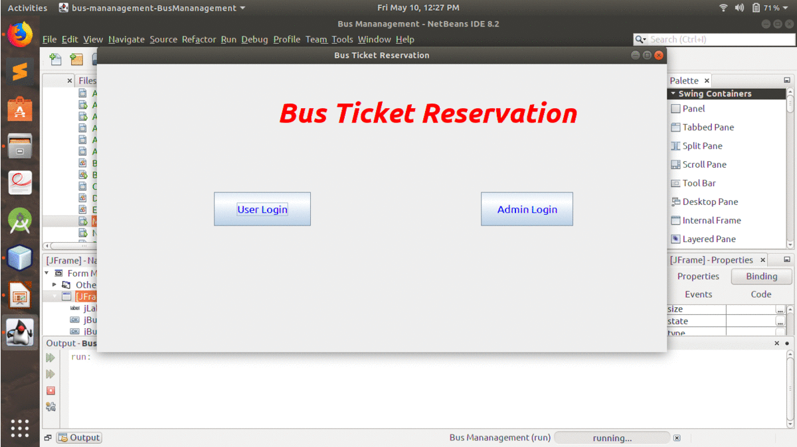

# Bus-Ticket-Management---Java
**A Gui Based Application that can reserve a seat for a long distance bus route**<br>
 The bus ticket booking system is a java project that maintains the official records of tours and travels. The whole system is made in Netbeans IDE. 
 *It also supports back-end using database*.
 ## Features
 > 1. Back End support
 > 2. Admin and User Dashboard with Login Systems
 > 3. Booking Tickets
 > 4. Cancel Tickets
 > 5. Reservation System
 > 6. Management of Employees
 > 7. Display of user details
 > 8. Display of admin Details
 > 9. Displays the information of Bus fare, seats Available , Buses Available
 > 10. Choosing System for destination and dates
 
 
 ## Running on your machine
 ### Netbeans IDE
 *Installing Netbeans IDE and running the main project i.e., the BusManagement.java .*<br>
  **Terminal**<br>
  Will work when adding JFrame to each page. And then running the commands :
  
  ```
   cd src
   cd bus
   cd management
   javac BusManagement.java
   java BusManagement
  
  ```
  ### Database
  *Using **phpmyadmin** we can dispay and manage the database to the admin or the account handler*<br>
  
  The local "bootRun" task has the following prerequisites:
   - a MySQL  instance up and runnning on localhost
   - a MySql user having root : root password: 
   - a database named busm
  

## Output-
<p align="center">  </p>


## Fix for 
1. Need to give the datarange for specifically for seeing the avilable tickets.<br>
2. Admin has full access to user Deatils.<br>
3. It only provides Bus Reservation


## Add-ons in Future
1. Hosting online. <br>
2. Sending Message to users after reservation and cancellation of tickets. <br>
3. Exceeding the Range of Database.
4. Maintaining a permanent databases each for a specific one, unlike the temporary database used in this project.


